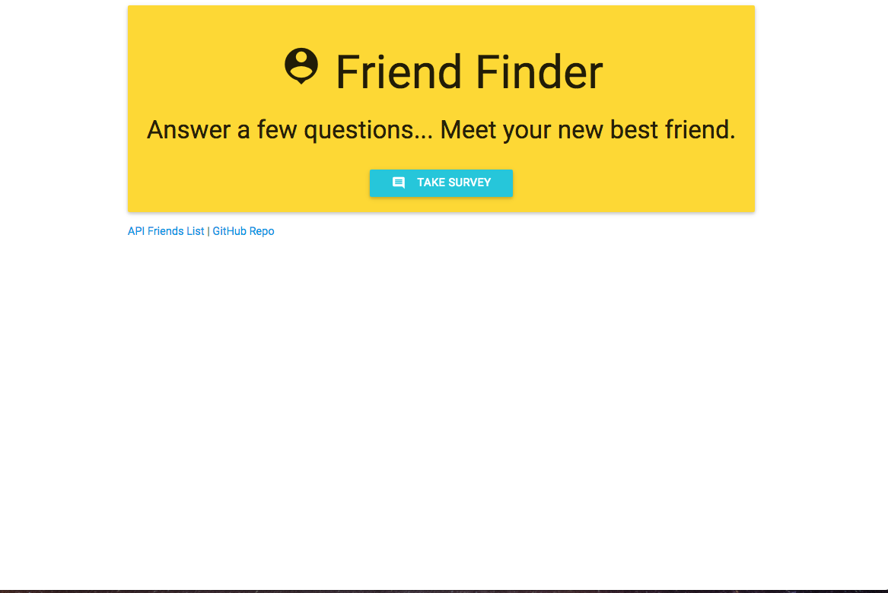
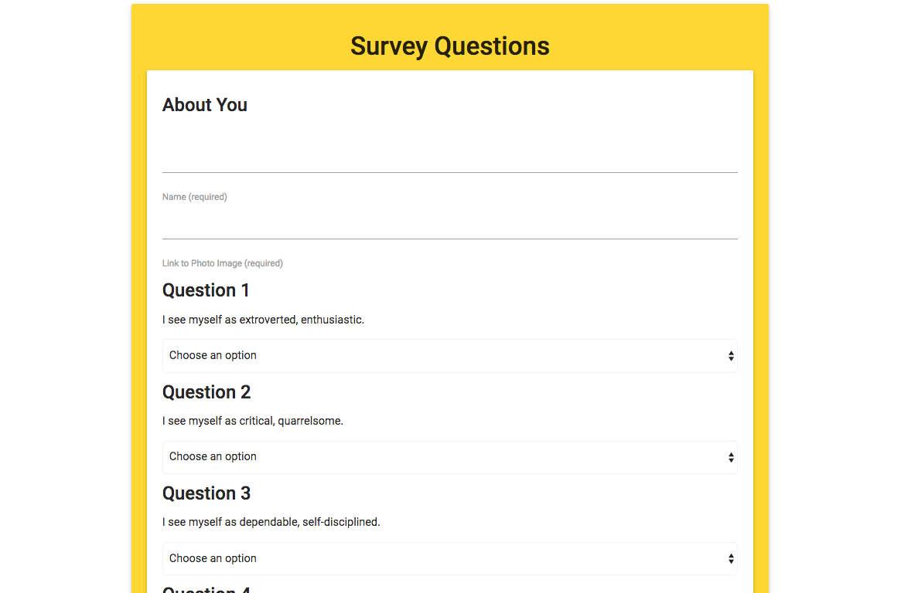

# FriendFinder

The goal was to create a Friend Finder app (essentially a dating app but for friends) using Node and Express servers. The user enters the page that leads to a survey. When the user submits the survey, they are matched with a "friend" that has the closest match to their personality.

## Getting Started
Simply head to https://friend-finder-abz.herokuapp.com/ to test out the app or download it via a git clone. Simply put 'npm install' in the terminal directed to the main folder, run 'node server.js' and then go to localhost:3000 to test it out. Have a picture ready to insert into the app!

## Screen Shots


Index Page


Survey

## Technologies used
- Node.js
- body-parager NPM Package - https://www.npmjs.com/package/inquirer
- express NPM Package - https://www.npmjs.com/package/express
- path NPM Package - https://www.npmjs.com/package/path

### Prerequisites

```
- Node.js - Download the latest version of Node https://nodejs.org/en/
- Materialize - Add CDN link to HTML http://materializecss.com/getting-started.html
```